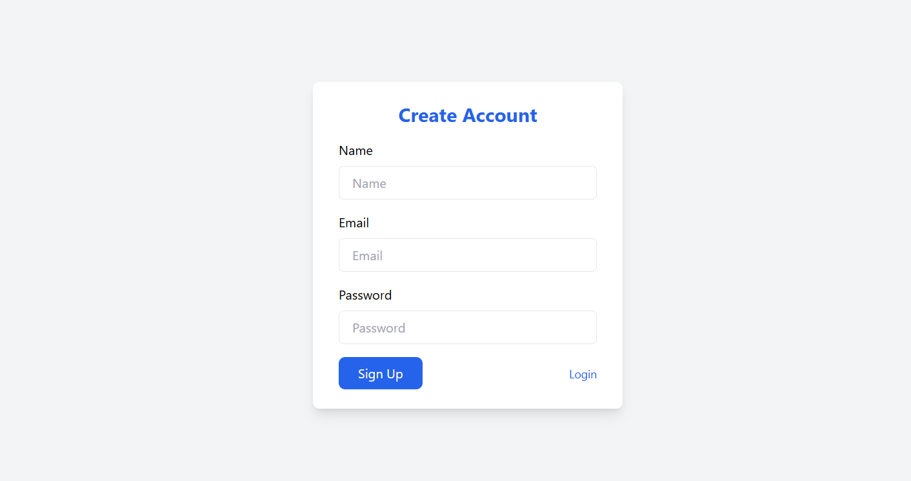
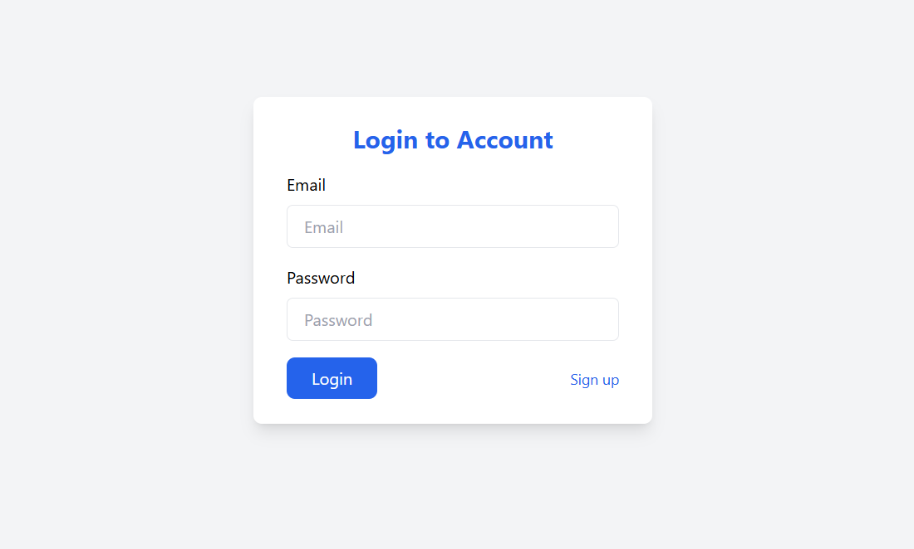
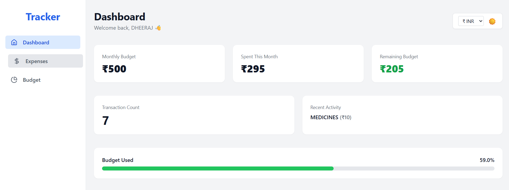
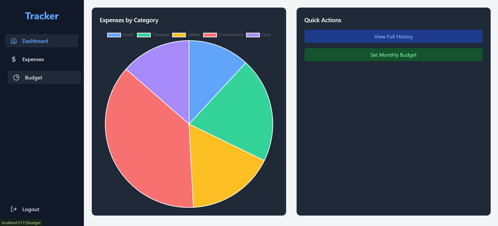
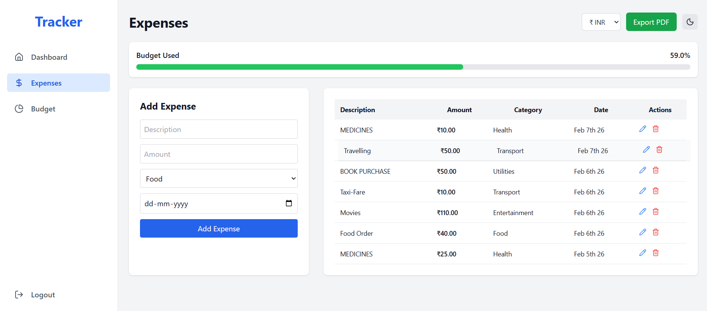
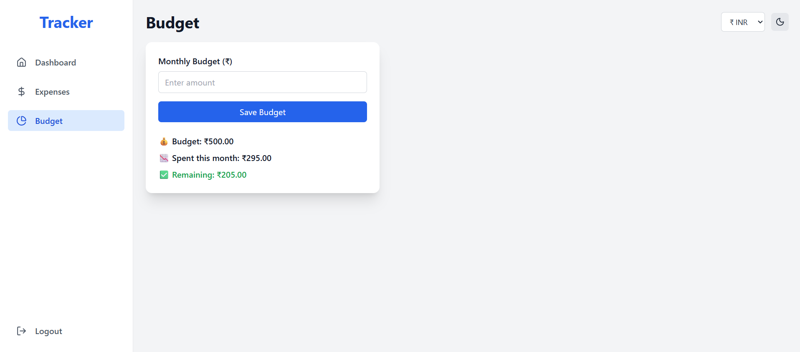

# 💸 Smart Expense Tracker

A full-stack **MERN-based Smart Expense Tracker** application designed to help users manage expenses, track monthly budgets, and gain clear financial insights through a modern, polished UI.

The application focuses on **usability, visual clarity, and smooth interactions**, with full dark mode support and a responsive design.

---

## 🚀 Key Features

- Secure authentication (JWT-based)
- Interactive dashboard with charts & budget insights
- Expense & budget management
- Currency support (INR / USD / EUR)
- PDF export of expenses
- Fully responsive UI with dark mode
- Smooth hover & micro-interactions

---

## 📸 Screenshots

### 🔐 Authentication



### 📊 Dashboard



### 💳 Expenses


### 💰 Budget


---

## 🔐 Authentication
- Secure JWT-based **Signup & Login**
- Protected routes for authenticated users

## 📊 Dashboard
- Monthly budget overview
- Total spent & remaining amount
- Budget usage progress bar
- Expense distribution by category (Pie Chart using Chart.js)
- Recent activity & transaction count
- Currency selector (INR / USD / EUR)
- Persistent dark mode

## 💳 Expense Management
- Add, edit, and delete expenses
- Preset & custom categories
- Monthly budget limit enforcement
- Budget usage indicator
- Export expenses as **PDF**
- Currency conversion support
- Smooth table row hover & slide effects
- Fully dark-mode compatible UI

## 💰 Budget Management
- Set and update monthly budget
- Real-time remaining / overspent calculation
- Currency support
- Hover-lift card animations
- Dark-mode compatible UI

## 🎨 UI / UX Enhancements
- Global dark mode using Tailwind `dark` class
- Hover lift effects on dashboard & budget cards
- Sidebar hover slide animation
- Smooth transitions & micro-interactions
- Clean, responsive layout (mobile & desktop)

---

## 🧱 Tech Stack

### Frontend
- React (Vite)
- Tailwind CSS
- React Router DOM
- Chart.js
- Axios
- Lucide Icons

### Backend
- Node.js
- Express.js
- MongoDB (Mongoose)
- JWT Authentication
- Bcrypt

### Utilities
- jsPDF & jspdf-autotable (PDF Export)
- Moment.js
- React Hot Toast

---

## 📂 Project Structure
```bash
smart-expense-tracker/
├── client/
│   ├── src/
│   │   ├── components/
│   │   ├── pages/
│   │   ├── context/
│   │   └── utils/
│   └── package.json
│
├── server/
│   ├── controllers/
│   ├── routes/
│   ├── models/
│   └── server.js
│
├── screenshots/
├── README.md
└── .gitignore
